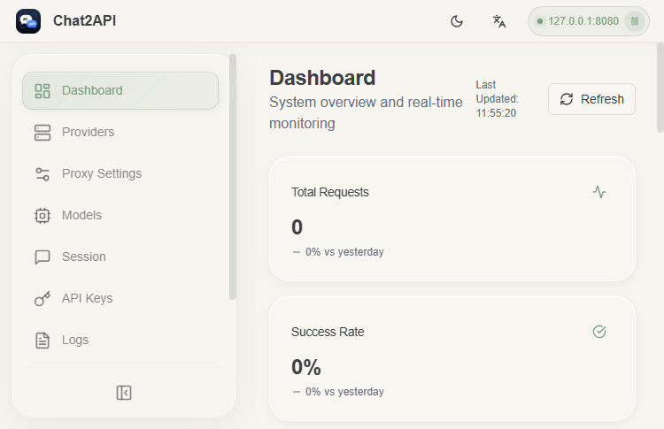
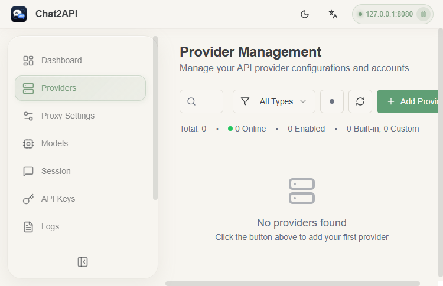

# Chat2API - FnOS 版

统一管理多个 AI 服务商的 API 代理工具。

## 功能

- 支持 OpenAI、Anthropic、Google、Azure、DeepSeek、月之暗面等 20+ 服务商
- 完整的 Web 管理界面（Dashboard、Providers、Proxy、Models、Sessions、Settings）
- 负载均衡策略（轮询/最小连接/优先级）
- API Key 鉴权管理
- 多账户管理与自动轮换
- 请求日志与统计
- 会话管理
- 模型映射与工具调用

## 默认配置

- 端口：8080
- 管理密钥：`chat2api-fpk-secret-2026`

## 安装

通过 FnDepot 应用中心安装或在 Releases 下载 fpk 手动安装。

## 使用

安装后桌面出现 Chat2API 图标，点击即可打开 Web 管理界面。

首次使用配置：
1. 进入 Settings → Management API → Enable
2. 修改默认管理密钥
3. 添加 Provider（API 提供商）
4. 配置账户凭据

## 截图

## 许可证

GPL-3.0
